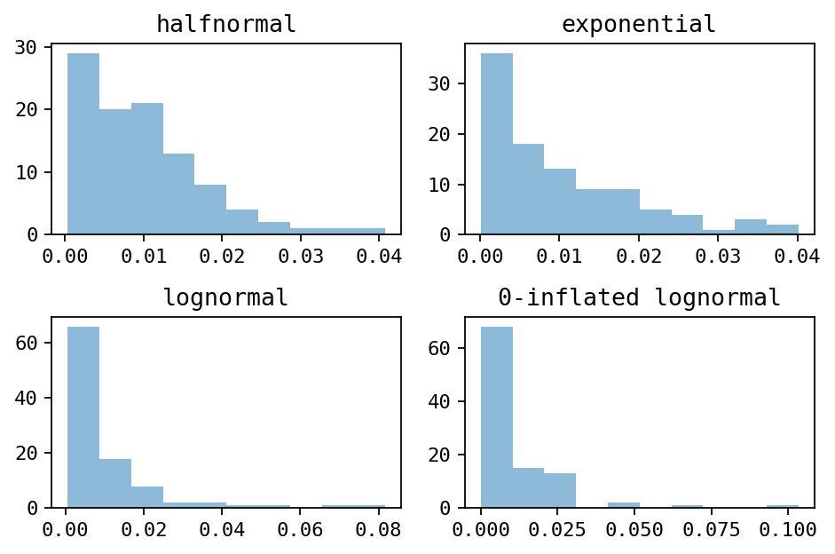

.. _generate:

Generating reads
================

InSilicoSeq comes with a set of pre-computed error models to allow the user to easily generate reads from the most popular Illumina instruments:

- HiSeq
- MiSeq
- NovaSeq

Per example generate 1 million MiSeq reads from a set of input genomes called `genomes.fasta`:

.. code-block:: bash

    iss generate --genomes genomes.fasta --model miseq --output miseq_reads

This will create 2 fastq files, `miseq_reads_R1.fastq` and `miseq_reads_R2.fastq` in your current directory, as well as `miseq_reads_abundance.txt`, a tab-delimited file containing the abundance of each genomes.

If you have created your custom model, change ``--model miseq`` to your custom model file:

.. code-block:: bash

    iss generate --genomes genomes.fasta --model model.npz --output model_reads

Required input files
--------------------

By default, InSilicoSeq only requires 1 file in order to start generating reads: 1 (multi-)fasta files containing your input genome(s).

If you don't want to use a multi-fasta file or don't have one at hand but are equipped with an Internet connection, you can download random genomes from the ncbi:

.. code-block:: bash

    iss generate --ncbi bacteria -u 10 --model miseq --output miseq_ncbi

The above command will generate reads from 10 random bacterial genomes from the NCBI

Additionally, you can supply tab separated kingdoms if you wish to have mixed datasets:

.. code-block:: bash

    iss generate -k bacteria viruses -u 10 4 --model miseq --output miseq_ncbi

The above command will generate reads from 10 random bacteria and 4 random viruses.
``--ncbi/-k`` accepts the following values: ``bacteria``, ``viruses`` and ``archaea``.

In addition the the 2 fastq files and the abundance file, the downloaded genomes will be saved in `miseq_ncbi_genomes.fasta` in your current directory.

*Note: If possible, I recommend using InSilicoSeq with a fasta file as input.*
*The eutils utilities from the ncbi can be slow and quirky.*

Abundance distribution
----------------------

With default settings, the abundance of the input genomes is drwan from a log-normal distribution.

Alternatively, you can use other distributions with the ``--abundance`` parameter: `uniform`, `halfnormal`, `exponential` or `zero-inflated-lognormal`

If you wish to fine-tune the distribution of your genomes, InSilicoSeq also accepts an abundance file:

.. code-block:: bash

    iss generate -g genomes.fasta --abundance_file abundance.txt -m HiSeq -o HiSeq_reads

Example abundance file for a multi-fasta containing 2 genomes: genome_A and genome_B.

.. code-block:: bash

    genome_A    0.2
    genome_B    0.8

For the abundance to make sense, the total abundance in your abundance file must equal 1.

    Histograms of the different distribution (drawn with 100 samples)

Full list of options
--------------------

--genomes
^^^^^^^^^

Input genome(s) from where the reads will originate

--ncbi
^^^^^^

Download input genomes from RefSeq instead of using --genomes.
Requires --n_genomes option.
Can be bacteria, viruses, archaea or a combination of the three (space-separated)

--n_genomes
^^^^^^^^^^^

How many genomes will be downloaded from the ncbi.
Required if --ncbi is set.
If more than one kingdom is set with --ncbi, multiple values are necessary (space-separated).

--abundance
^^^^^^^^^^^

Abundance distribution (default: lognormal).
Can be uniform, halfnormal, exponential, lognormal or zero_inflated_lognormal.

--abundance_file
^^^^^^^^^^^^^^^^

Abundance file for coverage calculations (default: None).

--n_reads
^^^^^^^^^

Number of reads to generate (default: 1000000).
Allows suffixes k, K, m, M, g and G (ex 0.5M for 500000).

--mode
^^^^^^^

Error model. If not specified, using kernel density estimation (default: kde).
Can be 'kde' or 'basic'

--model
^^^^^^^^

Error model file. (default: None).
Use HiSeq, NovaSeq or MiSeq for a pre-computed error model provided with the software, or a file generated with iss model.
If you do not wish to use a model, use --mode basic.
The name of the built-in models is case insensitive.

--gc_bias
^^^^^^^^^

If set, may fail to sequence reads with abnormal GC content.
Does not guarantee --n_reads (default: False)

--cpus
^^^^^^

Number of cpus to use. (default: 2).

--quiet
^^^^^^^

Disable info logging

--debug
^^^^^^^

Enable debug logging

--output
^^^^^^^^

Output file prefix (Required)
