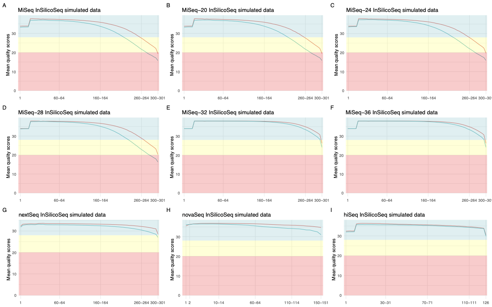

.. _model:

Error models
============

Pre-built models
----------------

Available models
^^^^^^^^^^^^^^^^

+------------+-------------+
| Model name | Read length |
+============+=============+
| MiSeq      | 300 bp      |
+------------+-------------+
| HiSeq      | 125 bp      |
+------------+-------------+
| NovaSeq    | 150 bp      |
+------------+-------------+

    Average per base quality profiles for the prebuilt error models

Qualities
^^^^^^^^^

The prebuilt models were built with the following commands:

.. code-block:: bash

    megahit -1 reads_R1.fastq -2 reads_R2.fastq -o asm
    bowtie2-build asm/final.contigs.fa miseq_asm/final.contigs
    bowtie2 -x asm/final.contigs -1 reads_R1.fastq \
        -2 reads_R2.fastq | samtools view -bS | samtools sort -o mapping.bam
    samtools index mapping.bam
    iss model -b mapping.bam -o name_of_model

The MiSeq model was built from an ocean metagenomics project in Kenya (sample accession number ERR1912174).

The HiSeq and NovaSeq models were built from human run obtained via basespace.

Creating an Error Model
-----------------------

If you do not wish to use the pre-computed error models provided with InSilicoSeq, it is possible to create your own.

InSilicoSeq creates error models from .bam files. The input bam file should be a set of reads aligned against a reference genome or metagenome.

Given you have two read files, `reads_R1.fastq.gz` and`reads_R2.fastq.gz`, and a reference metagenome `ref.fasta`:

Align you reads against the reference
^^^^^^^^^^^^^^^^^^^^^^^^^^^^^^^^^^^^^

.. code-block:: bash

    bowtie2-build ref.fasta ref
    bowtie2 -x ref -1 reads_R1.fastq.gz \
        -2 reads_R2.fastq.gz | samtools view -bS | samtools sort -o ref.bam
    samtools index ref.bam

Build the model
^^^^^^^^^^^^^^^

.. code-block:: bash

    iss model -b ref.bam -o my_model

which will create a `my_model.npz` file containing your newly built model

Full list of options
--------------------

--bam
^^^^^

aligned reads from which the model will be inferred (Required)

--model
^^^^^^^

Error model to build. If not specified, using kernel density estimation
(default: kde). Can be 'kde' or 'cdf'

--output
^^^^^^^^

 Output file prefix (Required)

--quiet
^^^^^^^

Disable info logging

--debug
^^^^^^^

Enable debug logging
